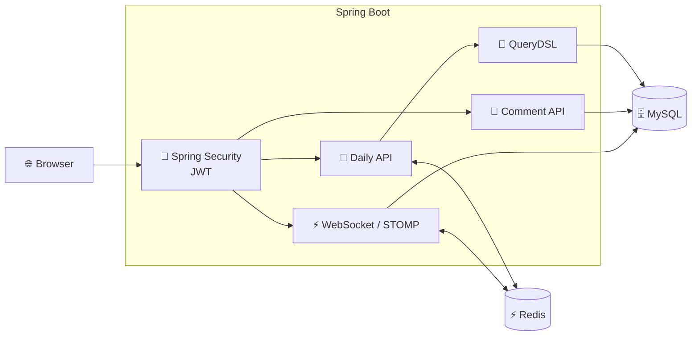
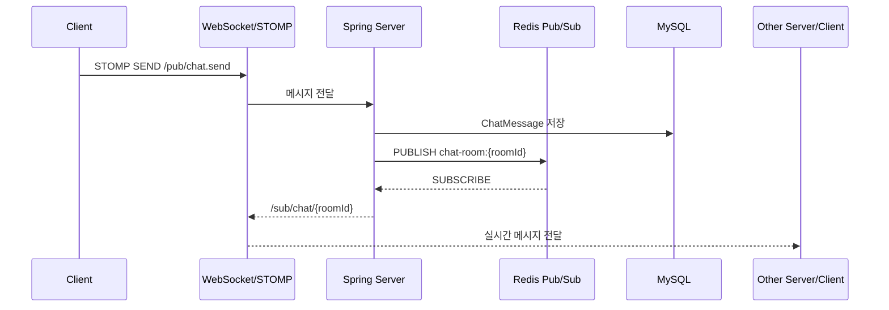
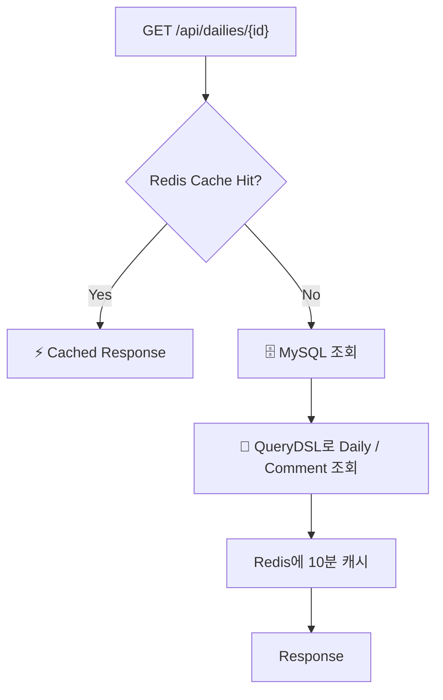

# 💬 Dailog

> **기록은 저장으로 끝나지 않는다.**  
> 나의 하루를 기록하고, 다른 사람과 이야기하며, 실시간으로 연결되는 **소통형 Daily 서비스**

<br>

<div align="center">

### 📝 Daily 기록 · 💬 실시간 채팅 · ❤️ 좋아요 · ⚡ Redis · 🔐 JWT

**Spring Boot 기반의 일상 공유 서비스**

</div>

---

## 👀 30초 요약

**Dailog**는 사용자가 일상을 기록하고 다른 사용자와 댓글·좋아요·실시간 채팅으로 소통할 수 있는 웹 서비스입니다.

단순 CRUD 구현에 그치지 않고, **조회 성능 / 동시성 / 실시간 통신 / 인증**을 직접 고민하며 다음과 같이 설계했습니다.

| 문제 | 적용한 기술 | 해결 방향 |
|---|---|---|
| 📖 자주 조회되는 Daily 상세 | **Redis Cache** | DB 반복 조회를 줄이고 캐시로 빠르게 응답 |
| 🔎 복잡한 조회 및 DTO Projection | **QueryDSL** | 필요한 데이터만 조회하고 동적/명시적 쿼리 구성 |
| ❤️ 동시에 발생하는 좋아요 | **JPA `@Version` + Retry** | 낙관적 락으로 좋아요 수 갱신 충돌 대응 |
| 💬 실시간 채팅 | **WebSocket + STOMP** | 서버와 클라이언트 간 실시간 양방향 통신 |
| 🔄 여러 서버 간 채팅 전달 | **Redis Pub/Sub** | 서버 인스턴스 간 메시지 전달 구조 구성 |
| 🔐 API / WebSocket 인증 | **Spring Security + JWT** | HTTP 요청과 STOMP CONNECT 단계에서 인증 |


---

## ✨ 주요 기능

### 📝 Daily

- Daily 작성 / 조회 / 수정 / 삭제
- 페이지네이션
- 최신 수정일 기준 정렬
- Daily 상세 조회
- 댓글 조회
- Daily 좋아요
- 수정/삭제 시 작성자 및 비밀번호 검증
- Daily 상세 데이터 Redis 캐싱

### 💬 Comment

- 댓글 작성 / 조회 / 수정 / 삭제
- 댓글 좋아요
- 댓글 작성 개수 제한
- 작성자 및 비밀번호 검증

### ❤️ Like

- 사용자별 Daily / Comment 중복 좋아요 방지
- `(daily_id, user_id)`, `(comment_id, user_id)` 복합 Unique Constraint
- 좋아요 수 증가 시 `@Version`을 이용한 낙관적 락
- 충돌 발생 시 재시도 로직 적용

### 🔐 User

- 회원가입
- 로그인
- JWT 발급
- JWT 기반 API 인증
- BCrypt 비밀번호 암호화
- 사용자 정보 수정 / 삭제

### 💬 Real-time Chat

- 채팅방 생성 / 조회
- 최근 메시지 조회
- 이전 메시지 조회
- STOMP 기반 실시간 메시지 전송
- 실시간 타이핑 상태 전달
- JWT 기반 STOMP CONNECT 인증
- Redis Pub/Sub을 이용한 서버 간 메시지 브로드캐스팅

---

# 🏗️ Architecture



### 채팅 메시지 흐름



### Daily 상세 조회 흐름



---

# 🎯 기술적으로 고민한 부분

## 1. Redis Cache — 반복되는 상세 조회를 줄이기

Daily 상세 페이지는 사용자가 반복적으로 접근할 수 있는 데이터입니다.

매 요청마다

```text
Client
  ↓
Spring
  ↓
MySQL
  ↓
Daily + Comment
```

를 수행하면 동일한 데이터를 계속 DB에서 읽게 됩니다.

그래서 상세 조회 결과를 Redis에 저장하는 **Cache-Aside 패턴**을 적용했습니다.

```text
요청
 ↓
Redis 조회
 ├─ HIT  → 즉시 응답
 │
 └─ MISS
      ↓
    MySQL
      ↓
    Redis 저장
      ↓
    응답
```

- Cache Key: `daily:{dailyId}`
- TTL: **10분**
- Daily 수정 / 삭제 / 좋아요 발생 시 관련 캐시 삭제

이를 통해 **자주 조회되는 상세 데이터에 대한 DB 접근을 줄이는 구조**를 구성했습니다.

---

## 2. QueryDSL — 필요한 데이터만 조회

기본 JPA 조회만 사용하는 대신 Daily 목록과 상세 조회에 QueryDSL을 적용했습니다.

### 목록 조회

DTO Projection을 사용하여 필요한 필드만 조회합니다.

```java
Projections.constructor(
    DailyDto.Response.class,
    daily.id,
    daily.title,
    daily.content,
    daily.author,
    daily.likes,
    daily.createdAt,
    daily.modifiedAt
)
```

또한

- `offset`
- `limit`
- `order by`
- `count`

를 직접 구성하여 페이지 조회를 구현했습니다.

### 상세 조회

Daily와 Comment 조회를 명시적으로 분리하여 필요한 데이터를 가져오도록 구성했습니다.

> **핵심 포인트:**  
> “JPA를 사용한다”에서 끝나는 것이 아니라, **조회 목적에 맞게 QueryDSL을 이용해 SQL 생성 과정을 통제**하는 경험을 목표로 했습니다.

---

# ❤️ 3. 좋아요 동시성 — `@Version` + Retry

좋아요 API에서 여러 사용자가 동시에 같은 Daily에 좋아요를 누르면 다음과 같은 문제가 발생할 수 있습니다.

```text
Thread A: likes = 10 조회
Thread B: likes = 10 조회

Thread A: 11 저장
Thread B: 11 저장

결과: 12가 되어야 하지만 11
```

이를 해결하기 위해 Daily Entity에 JPA의 `@Version`을 적용했습니다.

```java
@Version
private Long version;
```

그리고 좋아요 증가 과정에서

```java
try {
    daily.like();
    ...
} catch (ObjectOptimisticLockingFailureException e) {
    retry++;
    ...
}
```

와 같이 충돌 발생 시 최대 10회 재시도하도록 구현했습니다.

또한 중복 좋아요 자체는 DB에서 보장하도록

```text
UNIQUE (daily_id, user_id)
```

제약조건을 적용했습니다.

### 결과

```text
중복 요청 방지
       +
낙관적 락
       +
충돌 재시도
       ↓
동시 좋아요 상황에 대한 데이터 정합성 확보
```

---

# 💬 4. WebSocket + STOMP + Redis Pub/Sub

실시간 채팅은 단순 HTTP API만으로 구현하기 어렵습니다.

그래서

```text
HTTP
→ 과거 메시지 조회

WebSocket
→ 실시간 메시지 송수신
```

으로 역할을 분리했습니다.

### 메시지 조회

```http
GET /api/chat/rooms/{roomId}/messages
GET /api/chat/rooms/{roomId}/messages/before/{lastMessageId}
```

최근 메시지와 이전 메시지를 ID 기준으로 조회할 수 있도록 구성했습니다.

### 실시간 통신

```text
Client
   │
   │ STOMP SEND
   ▼
/pub/chat.send
   │
   ▼
Spring
   │
   ├── MySQL 저장
   │
   └── Redis PUBLISH
           │
           ▼
       Redis Pub/Sub
           │
           ▼
       Spring Subscriber
           │
           ▼
   /sub/chat/{roomId}
           │
           ▼
        Clients
```

Redis Pub/Sub을 중간에 둔 이유는 **Spring 서버가 여러 인스턴스로 확장되었을 때도 서로 다른 서버에 연결된 사용자에게 메시지를 전달할 수 있는 기반을 마련하기 위해서**입니다.

---

# 🔐 5. WebSocket에서도 JWT 인증

HTTP API뿐 아니라 WebSocket 연결에서도 인증이 필요합니다.

STOMP `CONNECT` 프레임의 `Authorization` 헤더를 가로채 JWT를 검증합니다.

```text
STOMP CONNECT
      │
      ▼
StompAuthInterceptor
      │
      ├─ Authorization 확인
      ├─ Bearer 제거
      ├─ JWT 검증
      ├─ 사용자 조회
      │
      ▼
accessor.setUser(...)
      │
      ▼
인증된 Principal로 WebSocket 통신
```

이를 통해 채팅 메시지 전송 시 별도의 `senderId`를 클라이언트가 임의로 전달하는 방식이 아니라,

```java
User sender = AuthenticatedUser.fromPrincipal(principal);
```

처럼 **인증된 사용자 정보를 서버에서 가져오도록** 구성했습니다.

---

# 🗂️ 프로젝트 구조

```text
dailog/
├── 📄 build.gradle
├── 📄 settings.gradle
├── 📄 Dockerfile
├── 📄 docker-compose.yml
│
├── 📁 gradle/
│   └── 📁 wrapper/
│
└── 📁 src/
    │
    ├── 📁 main/
    │   │
    │   ├── 📁 java/
    │   │   └── 📁 com.example.dailog/
    │   │       │
    │   │       ├── 🚀 Application
    │   │       │
    │   │       ├── 📁 common/
    │   │       │   ├── 📁 config/
    │   │       │   │   └── Spring / JPA / QueryDSL / Security / WebSocket 설정
    │   │       │   ├── 📁 config/redis/
    │   │       │   │   └── Redis Cache / Pub-Sub 설정 및 메시지 처리
    │   │       │   ├── 📁 constant/
    │   │       │   ├── 📁 dto/
    │   │       │   ├── 📁 entity/
    │   │       │   ├── 📁 enums/
    │   │       │   ├── 📁 exception/
    │   │       │   ├── 📁 filter/
    │   │       │   │   └── JWT 인증 필터
    │   │       │   ├── 📁 interceptor/
    │   │       │   │   └── STOMP WebSocket 인증
    │   │       │   └── 📁 utils/
    │   │       │       └── JWT 유틸리티
    │   │       │
    │   │       └── 📁 domain/
    │   │           │
    │   │           ├── 📁 user/
    │   │           │   ├── 📁 controller/
    │   │           │   ├── 📁 dto/
    │   │           │   ├── 📁 entity/
    │   │           │   ├── 📁 repository/
    │   │           │   └── 📁 service/
    │   │           │
    │   │           ├── 📁 daily/
    │   │           │   ├── 📁 controller/
    │   │           │   ├── 📁 dto/
    │   │           │   ├── 📁 entity/
    │   │           │   ├── 📁 repository/
    │   │           │   │   └── Spring Data JPA + QueryDSL Custom Repository
    │   │           │   └── 📁 service/
    │   │           │       └── Daily Business Logic + Redis Cache
    │   │           │
    │   │           ├── 📁 comment/
    │   │           │   ├── 📁 controller/
    │   │           │   ├── 📁 dto/
    │   │           │   ├── 📁 entity/
    │   │           │   ├── 📁 repository/
    │   │           │   └── 📁 service/
    │   │           │
    │   │           ├── 📁 chat/
    │   │           │   ├── 📁 controller/
    │   │           │   │   └── REST API + STOMP Message Handler
    │   │           │   ├── 📁 dto/
    │   │           │   ├── 📁 entity/
    │   │           │   ├── 📁 repository/
    │   │           │   └── 📁 service/
    │   │           │       └── Chat Query / Message Processing
    │   │           │
    │   │           └── 📁 chatroom/
    │   │               ├── 📁 controller/
    │   │               ├── 📁 entity/
    │   │               └── 📁 repository/
    │   │
    │   ├── 📁 resources/
    │   │   ├── application.yml
    │   │   ├── application-secret.yml
    │   │   │
    │   │   └── 📁 static/
    │   │       ├── HTML Pages
    │   │       ├── 📁 css/
    │   │       └── 📁 js/
    │   │           └── Frontend Logic
    │   │
    │   └── 📁 test/
    │       └── 📁 java/
    │           └── 📁 com.example.dailog/
    │               ├── 📁 common/
    │               │   └── JWT Utility Tests
    │               │
    │               └── 📁 domain/
    │                   └── 📁 daily/
    │                       ├── 📁 controller/
    │                       └── 📁 service/
    │                           └── Unit / Integration Tests
```

---

# 🛠️ Tech Stack

| Category | Technology |
|---|---|
| Language | **Java 17** |
| Framework | **Spring Boot 4.1.0** |
| Security | **Spring Security + JWT** |
| ORM | **Spring Data JPA / Hibernate** |
| Query | **QueryDSL 5** |
| Database | **MySQL 8** |
| Cache / Messaging | **Redis 7** |
| Real-time | **WebSocket + STOMP + SockJS** |
| Build | **Gradle** |
| Container | **Docker / Docker Compose** |
| Frontend | **HTML / CSS / JavaScript** |
| Test | **JUnit / Spring Boot Test** |

---

# 📡 주요 API

## User

| Method | Endpoint | Description |
|---|---|---|
| `POST` | `/api/users/register` | 회원가입 |
| `POST` | `/api/users/login` | 로그인 |
| `GET` | `/api/users/{id}` | 사용자 조회 |
| `PATCH` | `/api/users/{id}` | 사용자 수정 |
| `DELETE` | `/api/users/{id}` | 사용자 삭제 |

## Daily

| Method | Endpoint | Description |
|---|---|---|
| `POST` | `/api/dailies` | Daily 작성 |
| `GET` | `/api/dailies` | Daily 목록 / 페이지 조회 |
| `GET` | `/api/dailies/{id}` | Daily 상세 조회 |
| `PATCH` | `/api/dailies/{id}` | Daily 수정 |
| `DELETE` | `/api/dailies/{id}` | Daily 삭제 |
| `POST` | `/api/dailies/{id}/likes` | 좋아요 |

## Comment

| Method | Endpoint | Description |
|---|---|---|
| `POST` | `/api/comments/{id}` | 댓글 작성 |
| `GET` | `/api/comments/{id}` | 댓글 조회 |
| `PATCH` | `/api/comments/{id}` | 댓글 수정 |
| `DELETE` | `/api/comments/{id}` | 댓글 삭제 |
| `POST` | `/api/comments/{id}/likes` | 댓글 좋아요 |

## Chat

| Method | Endpoint | Description |
|---|---|---|
| `GET` | `/api/chat/rooms` | 채팅방 조회 |
| `POST` | `/api/chat/rooms?name={name}` | 채팅방 생성 |
| `GET` | `/api/chat/rooms/{roomId}/messages` | 최근 메시지 조회 |
| `GET` | `/api/chat/rooms/{roomId}/messages/before/{lastMessageId}` | 이전 메시지 조회 |

### WebSocket

```text
Endpoint
/ws

Publish
/pub/chat.send

Subscribe
/sub/chat/{roomId}

Typing
/pub/chat.typing
/sub/chat/{roomId}/typing
```

---

# 🐳 실행 방법

## 1. Docker Compose 실행

```bash
docker compose up --build
```

실행되는 서비스:

```text
MySQL   : 3307 → 3306
Redis   : 6379
Spring  : 8080
```

## 2. 접속

```text
http://localhost:8080
```

> 로컬 환경에서는 `application-secret.yml` 또는 환경변수를 이용해 DB 접속 정보를 설정합니다.

---

# 🧪 Test

현재 프로젝트에는 다음과 같은 테스트가 포함되어 있습니다.

```text
JwtUtilTest
DailyControllerTest
DailyServiceTest
DailyServiceIntegrationTest
Chapter03DailyApplicationTests
```

특히 Daily 영역에서는

- Controller 계층 테스트
- Service 단위 테스트
- Integration 테스트

를 분리하여 핵심 기능을 검증했습니다.

---

# 📌 설계에서 중요하게 본 것

### 1. 데이터 정합성

```text
중복 좋아요
    ↓
DB Unique Constraint

동시 좋아요
    ↓
@Version + Optimistic Lock + Retry
```

### 2. 읽기 성능

```text
반복 상세 조회
    ↓
Redis Cache

목록 / 상세 조회
    ↓
QueryDSL Projection
```

### 3. 실시간성

```text
WebSocket + STOMP
        +
Redis Pub/Sub
        ↓
실시간 메시지 전달
```

### 4. 인증 신뢰성

```text
HTTP
 └─ JWT Filter

WebSocket
 └─ STOMP CONNECT Interceptor
```

---

# 💡 프로젝트를 통해 배운 것

이 프로젝트를 구현하면서 단순히 API를 완성하는 것보다 **“사용자가 많아지면 어디가 병목이 될까?”**를 먼저 생각하는 것이 중요하다는 것을 배웠습니다.

특히 다음과 같은 문제를 직접 코드 수준에서 다뤘습니다.

- DB 반복 조회 → **Redis Cache**
- 조회 쿼리 제어 → **QueryDSL**
- 동시 좋아요 → **Optimistic Lock**
- 중복 좋아요 → **DB Unique Constraint**
- 실시간 통신 → **WebSocket / STOMP**
- 서버 간 메시지 전달 → **Redis Pub/Sub**
- WebSocket 인증 → **STOMP Interceptor + JWT**


---

<div align="center">

### 💬 Dailog

**Write your day. Share your story. Stay connected.**

</div>
